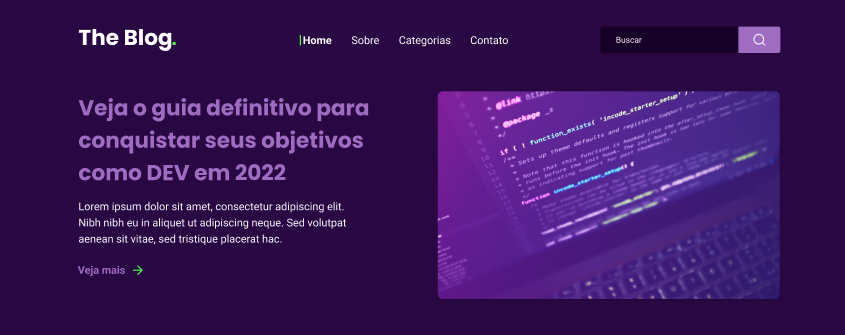

# 🚀📰RockteBlog

## 📝 Descrição

Projeto de Fazer um Blog de Noticias Tecnologicas.

Esse Projeto veio de um desafio da [Rocktesite](https://app.rocketseat.com.br/), nesse desafio tinha o proposito de melhorar minhas habilidades com CSS, e principalmente entender melhor sobre *Flexbox*.
Para fazer o Desafio não tinha um código fonte para copiar e colar ou tirar dúvida,ou Seja o código é totalmente meu,tive ajuda apenas do [Design dispobilizado no Figma](https://www.figma.com/file/6cjYoOz7at8rtFh8SgLypc/DD-RocketBlog-Copy?fuid=1055871148984695989) *o que ajuda bastante*.

Para fazer o desafio clique [aqui](https://app.rocketseat.com.br/discover/challenges/rocketblog)

## 🗃 Linguagens

- 
- 

## ⚒ Ferramentas e Sites Auxiliadores

- VSCode
- Github Desktop
- Figma

## ⚙️ Ajustes e Melhorias

❌ Arrumar a responsividade ¯\_(ツ)_/¯

## 👨🏾‍💻 Feito por

<table>
  <tr>
    <td align="center">
    <a href="#">
         
        
          <b>Jean Pedro</b>
        
      </a>
    </td>
  </tr>
</table>
